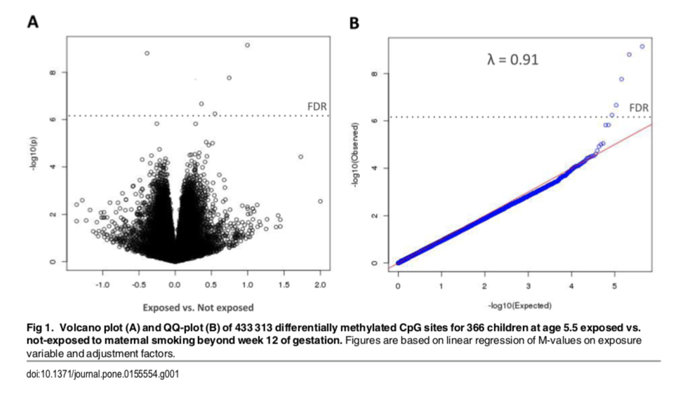

| **Statistical Analyses**	|  **IV(s)**  |  **IV type(s)** |  **DV(s)**  |  **DV type(s)**  |  **Control Var** | **Control Var type**  | **Question to be answered** | **_H0_** | **alpha** | **link to paper**| 
|:----------:|:----------|:------------|:-------------|:-------------|:------------|:------------- |:------------------|:----:|:-------:|:-------|
Correlation	|1, prenatal exposure to maternal tobacco smoking over 12wk | dichotomous| 1, DNA methylation| continuous | 0 | N/A| 	Will there be potential associations between exposure to maternal smoking leading and DNA-Methylation? | Maternal smoking and DNA-Methylation are not correlated | 0.05 | [Maternal Smoking during Pregnancy and DNA-Methylation in Children at Age 5.5 Years: Epigenome-Wide-Analysis in the European Childhood Obesity Project (CHOP)- Study(https://journals.plos.org/plosone/article/file?id=10.1371/journal.pone.0155554&type=printable) |
  |||||||||
  

